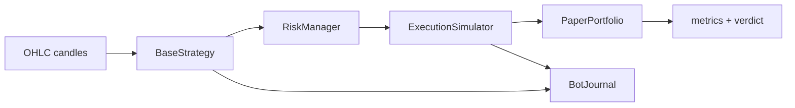

# Paper bot design — Phase 14 (Agent 62)

## Flux

## Modules

| Module | Responsabilité |
|--------|----------------|
| `paper_engine.run_paper_backtest` | Boucle bar-by-bar |
| `portfolio.PaperPortfolio` | Cash, positions, fills |
| `execution_simulator` | Slippage + fees |
| `risk_manager` | Caps position / exposure / DD / daily loss |
| `journal` | `decisions.jsonl` + trades |
| `metrics` | Sharpe, DD, cost drag, verdict |

## Verdicts

`kill`, `blocked_costs`, `blocked_risk`, `paper_candidate`, `blocked_data`, `insufficient_trades`, `micro_live_candidate` (opt-in explicite seulement).

## Non-objectifs

- Pas de connexion Kraken
- Pas de modification `src/execution.py` / `src/risk.py`
- Pas de promesse PnL live
