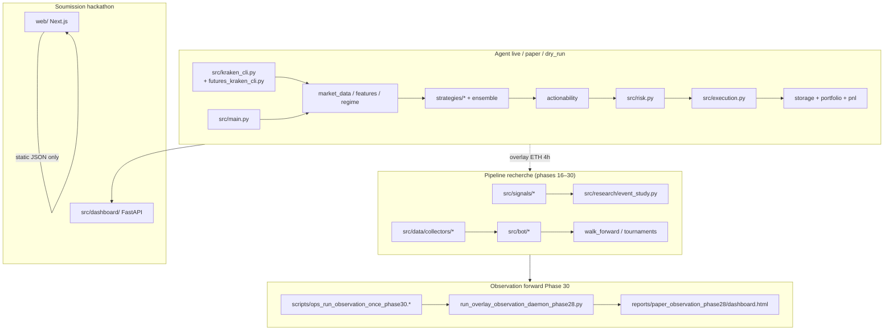

# Phase 1 — Audit complet du dépôt (read-only)

**Branche auditée :** `phase30/observation-ops-ux`  
**Date :** 2026-05-21  
**Baseline tests :** `894 tests collected` — suite verte (`python -m pytest -q`, ~131 s)

---

## Résumé exécutif

Le dépôt **kraken-alpha-agent** est un agent de trading xStocks (Kraken CLI) couplé à un pipeline de recherche quantitatif étendu (`src/bot/`, phases 16–30). L’architecture est **mature et testée** (894 tests), avec des garde-fous live solides (triple opt-in, mock CLI, futures 1×). Les principaux écarts identifiés sont **documentaires** (README obsolète sur le nombre de tests), **l’absence totale de CI** dans le repo, et quelques **lacunes de couverture** sur les modules orchestrateur/LLM/dashboard. Aucun secret commité détecté ; les fichiers sensibles (`config.yaml`, `execution.py`, `risk.py`, `futures_kraken_cli.py`, `web/`) n’ont pas été modifiés durant cet audit.

**Score global avant correctifs : 72/100**

---

## Grille de scores (/100)

| Zone | Score | Commentaire |
|------|-------|-------------|
| A. Architecture & séparation des concerns | 8/10 | Pipeline agent (`src/main.py`) vs recherche (`src/bot/`, `src/research/`) clair ; dualité `src/portfolio.py` / `src/bot/portfolio.py` documentée mais source de confusion |
| B. Qualité code & conventions | 8/10 | Ruff + Pydantic v2 ; scripts phase-numérotés cohérents |
| C. Tests & couverture | 8/10 | 894 tests, 123 fichiers ; gaps sur `main`, `llm_explainer`, `dashboard/app`, `btc_mempool` |
| D. CI/CD | 3/10 | Aucun workflow `.github/` ; validation manuelle uniquement |
| E. Sécurité | 8/10 | `.env` gitignored, masquage logs ; futures keys absentes de `_SECRET_ENV_NAMES` |
| F. Documentation | 6/10 | `docs/` riche (24+ MD) ; README claim « 232 tests » faux ; pas d’ARCHITECTURE/QUALITY centralisés |
| G. Scripts & ops | 7/10 | 77 scripts Python + 6 sh + 2 ps1 ; pas d’index scripts ; ops Phase 30 solides |
| H. Dépendances | 7/10 | `requirements.txt` minimal ; pas de lockfile ; optuna optionnel documenté |
| I. Hygiène dead code | 8/10 | Peu de code orphelin ; signaux backlog (btc_mempool) intentionnellement conservés |
| J. Observabilité forward | 9/10 | Phase 28–30 : daemon, dashboard statique, alerts, cron VPS |
| **Total** | **72/100** | |

---

## Table des risques (P0–P3)

| ID | Niveau | Risque | Preuve (fichiers) | Mitigation recommandée |
|----|--------|--------|-------------------|------------------------|
| R1 | **P1** | README et docs jury citent « 232 tests » — sous-estimation ~4× | `README.md` L53, L85 ; `SUBMISSION_QUICKSTART.md` (si présent) | Mettre à jour avec count réel ; CI qui affiche le total |
| R2 | **P1** | Pas de CI — régressions non détectées avant merge | Absence de `.github/workflows/` | Workflow pytest-only sur push/PR |
| R3 | **P2** | Clés futures non masquées dans les logs | `src/logger.py` L18–22 (`KRAKEN_FUTURES_*` absents) | Documenter dans QUALITY ; patch logger hors scope audit (fichier core adjacent) |
| R4 | **P2** | Dual portfolio confond agents et chercheurs | `src/portfolio.py` vs `src/bot/portfolio.py` ; imports croisés dans `src/strategies/` | `docs/ARCHITECTURE.md` + `docs/PAPER_TRADING_BOT.md` |
| R5 | **P2** | `btc_mempool` signal sans collector ni tests | `src/signals/btc_mempool.py` ; `docs/DATA_SOURCES.md` L498 | Backlog documenté — ne pas supprimer |
| R6 | **P3** | Scripts inspecteurs non référencés par tests | `scripts/_inspect_wf_crypto.py`, `scripts/_inspect_wf_results.py` | Garder comme outils opérateur ; indexer dans `scripts/README.md` |
| R7 | **P3** | `.cursor/` entièrement gitignored — règles projet non partagées | `.gitignore` L47 | Exception `!.cursor/rules/**` |
| R8 | **P3** | Rapports git-modifiés non liés à l’audit | `reports/regime_router_*`, `reports/paper_daemon_state/` | Ne pas committer sans demande explicite |

---

## Carte d’architecture

---

## Table des entrypoints

| Entrypoint | Rôle | Mode |
|------------|------|------|
| `scripts/run_agent_loop.py` | Boucle agent compétition xStocks | dry_run / paper / live |
| `scripts/dry_run_once.py` | Un cycle complet sans ordre | dry_run |
| `scripts/run_paper_daemon.py` | Daemon paper bot recherche | paper sim |
| `scripts/run_overlay_observation_daemon_phase28.py` | Observation overlay ETH 4h | forward paper |
| `scripts/ops_run_observation_once_phase30.ps1` / `.sh` | Ops cron : refresh cache + once | ops |
| `scripts/backtest_xstocks.py` | Backtest soumission xStocks | offline |
| `scripts/walk_forward_*.py` | Walk-forward crypto/xStocks | offline |
| `scripts/validate_live_xstocks.py` | Validation wire-level spot | live prep |
| `scripts/live_preflight.py` | Preflight triple opt-in | live prep |
| `uvicorn src.dashboard.app:app` | Dashboard FastAPI local | read |
| `web/` (Next.js) | Dashboard jury Vercel | static |

Orchestrateur central : `src/main.py` (`run_one_cycle`, `run_loop`) — importé par `dry_run_once.py`, `run_agent_loop.py`.

---

## Candidats dead code (classification)

| Fichier | Classification | Preuve | Action |
|---------|----------------|--------|--------|
| `src/signals/btc_mempool.py` | **BACKLOG_DATA** | Exporté `src/signals/__init__.py` ; pas de collector ; `docs/DATA_SOURCES.md`, `reports/RESEARCH_DECISION_BOARD.md` | **KEEP** |
| `scripts/_inspect_wf_crypto.py` | **OPERATOR_TOOL** | Standalone ; non importé | **KEEP** — documenter |
| `scripts/_inspect_wf_results.py` | **OPERATOR_TOOL** | Standalone CLI | **KEEP** |
| `reports/_build_leaderboard.py` | **ACTIVE** | Importé par `tests/test_leaderboard_phase12.py` L8 | **KEEP** |
| Racine `.*.sh`, `.*.py` | **GITIGNORED_LOCAL** | `.gitignore` L57–58 | Hors repo — OK |

**SAFE_TO_DELETE identifiés : 0** (aucune suppression recommandée sans preuve d’absence de référence).

---

## Logique dupliquée

| Domaine | Fichiers | Nature |
|---------|----------|--------|
| Portfolio | `src/portfolio.py` (SQLite/live) vs `src/bot/portfolio.py` (PaperPortfolio) | **Intentionnel** — contextes différents |
| Risk | `src/risk.py` (agent live) vs `src/bot/risk_manager.py` (backtest) | **Intentionnel** — APIs différentes |
| Scripts phase | `_phase22_common.py`, `_phase23_common.py`, `_phase26_common.py`, `_phase27_common.py` | Héritage progressif ; `_phase26/27` importent `_phase23` |
| Walk-forward | `src/walk_forward.py` vs `src/bot/walkforward.py` | Agent xStocks vs crypto research |

---

## Lacunes de couverture tests

| Module | Tests directs | Couverture indirecte |
|--------|---------------|----------------------|
| `src/main.py` | Non | `dry_run_once`, `test_dry_run_safety` |
| `src/llm_explainer.py` | Non | — |
| `src/pnl.py` | Non | storage / execution tests |
| `src/dashboard/app.py` | Non | `test_backtest`, `test_market_hours` (partiel) |
| `src/signals/btc_mempool.py` | Non | backlog |
| `src/signals/options_expiry.py` | Non | script `event_study_deribit_expiry.py` seulement |
| `src/logger.py` | Non | utilisé partout |

---

## Lacunes CI/CD

- Aucun `.github/workflows/*.yml`
- Pas de pre-commit hook versionné
- Pas de job lint (ruff) automatisé
- Déploiement Vercel externe (push `master`) — hors repo

---

## Findings sécurité

| Finding | Sévérité | Fichier |
|---------|----------|---------|
| `.env` gitignored, `.env.example` sans secrets | OK | `.gitignore`, `.env.example` |
| Triple opt-in live testé | OK | `tests/test_risk.py`, `tests/test_risk_aggressive.py` |
| Masquage secrets partiel (spot + featherless) | P2 | `src/logger.py` |
| Scripts live refusent clés vides | OK | `scripts/validate_live_xstocks.py` L205–209 |
| Fichiers sensibles non modifiés (contrainte audit) | OK | git diff ciblé |

---

## Lacunes documentation

- README : count tests obsolète (232 → 894)
- Manque : `docs/ARCHITECTURE.md`, `docs/QUALITY.md`, `docs/DECISIONS.md`
- Manque : `.cursor/rules/project.mdc`
- Manque : index `scripts/README.md`
- `docs/PAPER_TRADING_BOT.md` existe (dual portfolio) — à lier depuis ARCHITECTURE

---

## Quick wins (< 2 h)

1. Corriger count tests dans README (+ lien QUALITY)
2. Ajouter CI pytest-only (`.github/workflows/ci.yml`)
3. Créer `docs/ARCHITECTURE.md`, `docs/QUALITY.md`, `docs/DECISIONS.md`
4. Enrichir `.env.example` (KRAKEN_CLI_TRANSPORT, KRAKEN_ALPHA_PROFILE, SHORTING_ENABLED)
5. Ajouter `scripts/README.md` (catégories scripts)
6. Autoriser commit `.cursor/rules/` via exception gitignore
7. Makefile minimal (`test`, `lint`, `audit-bundle`)

---

## Ordre de patch recommandé

1. Docs architecture + qualité + décisions  
2. Règles Cursor + exception gitignore  
3. `.env.example` + `scripts/README.md` + README sync  
4. CI workflow + Makefile  
5. Rapport final — **pas de dead code delete** (0 SAFE_TO_DELETE)  
6. **Skip** refactor Phase 5 (ROI faible, fichiers core touchés)
